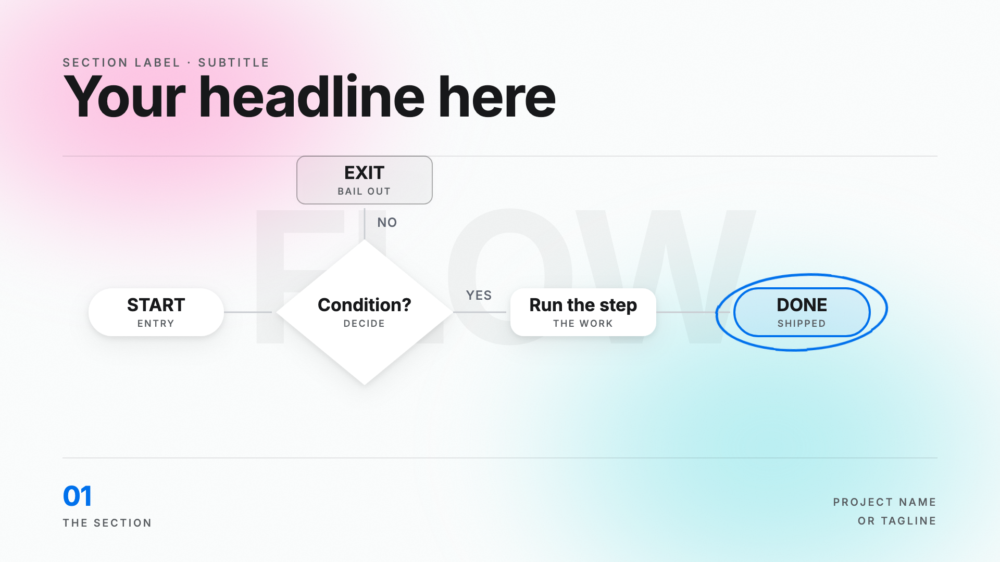
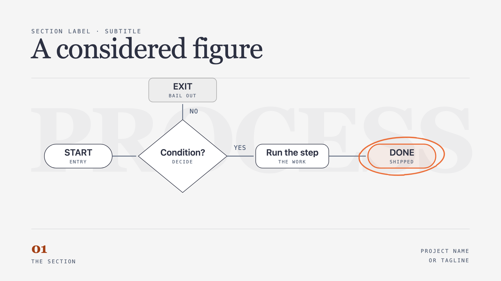

# ModernFlow

An [Agent Skill](https://code.claude.com/docs/en/skills) for building editorial
diagrams that move — flowcharts, loops, decision trees, layer stacks,
comparisons — and shipping them as a still PNG, a self-playing HTML animation,
or a narrated video.

| `soft-gradient` | `editorial-paper` |
| --- | --- |
|  |  |

The same figure, the same classes, one attribute changed.

## Why

Diagrams generated on demand tend to arrive with an invented palette, arbitrary
type, arrows that miss their boxes, and grey labels that fail an accessibility
check. This skill supplies the missing parts: a fixed visual system, per-type
layout contracts, a motion vocabulary, and gates that catch the failures which
still *look* fine.

## Install

Copy the folder into your skills directory:

```bash
git clone https://github.com/<you>/modernflow.git ~/.claude/skills/modernflow
```

- **Claude Code / Agent SDK** — `~/.claude/skills/` (personal) or
  `.claude/skills/` (project)
- **Claude.ai** — zip the folder and upload it in Settings → Capabilities
- **Claude API** — upload via the Skills API

Then just ask for a diagram. The skill loads itself when the request matches.

## Requirements

**None** for the still and animated tiers — Python 3 (stdlib only) plus a
browser to view. Rendering a PNG automatically also needs Chrome or Chromium.

Only the MP4 tier needs anything else: [HyperFrames](https://hyperframes.heygen.com)
(`npm i -g hyperframes`). Without it the skill still delivers a self-playing
HTML and says so.

## Use it directly

```bash
cp assets/template.html figure.html
# edit: the figure, the chrome text, the --at times

python3 scripts/fetch_fonts.py figure.html --profile soft-gradient
python3 scripts/check_contrast.py figure.html      # WCAG AA gate — must exit 0
python3 scripts/build.py figure.html --png
```

`build.py` inlines the fonts and stylesheet, so the output is **one portable
HTML file** that plays in any browser with no server and no network.

## What's inside

```
SKILL.md                  entry point — tier routing, build loop, the rules
reference/
  style-profiles.md       the two visual systems, canvas sizes, backgrounds
  diagram-types.md        when to use each type + its layout maths
  motion-grammar.md       timing, entrances, seams, narration sync, the gates
  video-pipeline.md       the MP4 tier
  gotchas.md              ten failures that ship looking correct
assets/
  tokens.json             machine-readable style tokens
  base.css                tokens, text roles, shapes, CSS motion vocabulary
  template.html           a working figure to clone
scripts/
  fetch_fonts.py          subset fonts to the glyphs actually used
  build.py                inline to one file; optional PNG
  check_contrast.py       WCAG AA gate over every text role
evals/                    three end-to-end scenarios
```

## Two profiles

| | `soft-gradient` | `editorial-paper` |
| --- | --- | --- |
| Look | Near-white paper, blurred warm/cool colour fields, Inter 900, one blue, white cards floating on soft shadows | Warm grey paper, flat, Instrument Serif, one orange, cards drawn with hairline borders |
| Best at | Vertical social, product explainers | Landscape figures, architecture, decision documents |

Both ship **contrast-corrected**. The pale grey label this register is known
for measures ~2.1:1 over a colour field; `scripts/check_contrast.py` found it
and the shipped tokens are the corrected values.

## Design notes

**The animation is pure CSS.** Every animated element carries one inline
`--at` start time and `stroke-dasharray` uses SVG `pathLength="1"`, so paths
draw with no JavaScript measurement. That same timing table drives the video
tier, so the two outputs cannot drift apart.

**Layout is parametric.** Same inputs, same coordinates. Edge endpoints are
solved from node boundaries rather than placed by eye — which is why arcs meet
their cards on a tall ellipse, where a fixed angular gap leaves them floating.

## Credits

The diagram grammar — shape carries meaning, one accent per figure, explicit
per-type layout contracts, complexity budgets — is adapted from
[**diagram-design**](https://github.com/cathrynlavery/diagram-design) by
Cathryn Lavery (MIT). It is a reference, not a dependency: no code from it is
vendored or executed here. See [`NOTICE`](NOTICE) for the full breakdown of
what was adapted and what is new.

Fonts (Inter, Instrument Serif, Geist, Noto Sans SC, Noto Serif SC) are SIL
Open Font License 1.1 and are fetched at build time, not vendored.

## License

MIT — see [`LICENSE`](LICENSE).
